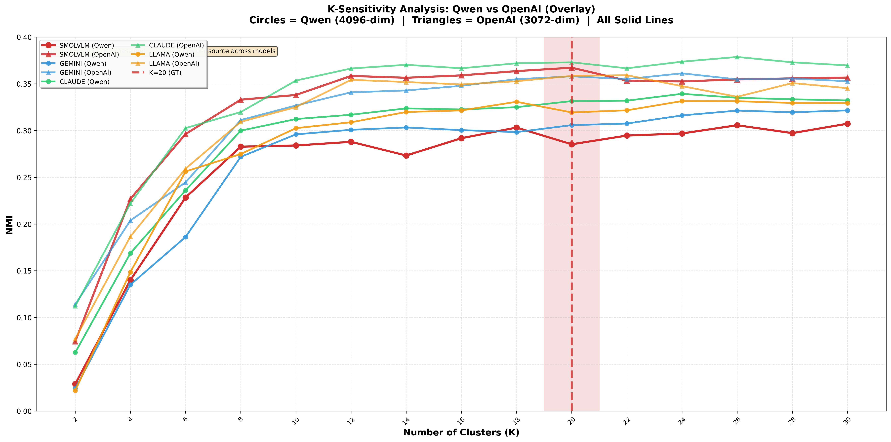

# LLM-based Description Enrichment for Short Video Clustering

> **KDMiLe 2026** — Symposium on Knowledge Discovery, Mining and Learning<br>
> Juliano Yugoshi · Ricardo Marcacini<br>
> Institute of Mathematics and Computer Science, University of São Paulo (ICMC-USP), Brazil<br>
> `{juliano.yugoshi, ricardo.marcacini}@usp.br`

[](https://www.python.org/)
[](LICENSE)
[](https://www.microsoft.com/en-us/research/publication/msr-vtt-a-large-video-description-dataset-for-bridging-video-and-language/)


---

<p align="center">
  
  <br/>
  <em>Figure 1 — The proposed method implements a 5-step pipeline: from raw short-video collection to unsupervised semantic clustering via compact VLM captioning, LLM-based description enrichment, and dense text embedding.</em>
</p>

---

## 📌 Table of Contents

- [Overview](#overview)
- [Key Contributions](#key-contributions)
- [Method](#method)
- [Results](#results)
- [Repository Structure](#repository-structure)
- [Installation](#installation)
- [Usage](#usage)
- [Dataset](#dataset)
- [Configuration](#configuration)
- [Citation](#citation)
- [License](#license)

---

## Overview

The rapid growth of short-video platforms (TikTok, YouTube Shorts, Instagram Reels) has
generated massive unlabeled video collections that are expensive to organize manually.
**Video clustering** offers a scalable, unsupervised alternative, but its quality is limited
by the richness of the video representations used.

Compact Vision-Language Models (VLMs) produce short, generic captions that capture only
immediately visible elements, creating a *semantic gap* between low-level visual signals and
high-level meaning. This work addresses that gap by introducing an **LLM-based semantic
enrichment stage** between caption generation and embedding projection.

> **Core Question:** *Can LLM-based semantic enrichment of compact visual descriptions
> improve unsupervised short-video clustering quality?*

**Answer:** Yes — improvements of up to **13.18% in NMI** over the baseline are observed,
statistically validated via paired Wilcoxon tests (p < 10⁻³) and Cohen's d effect size analysis.

---

## Key Contributions

| # | Contribution |
|---|---|
| (i) | A **semantic enrichment method** for video clustering that improves unsupervised performance without fine-tuning or annotation |
| (ii) | Analysis of how **heterogeneous LLMs** contribute complementary semantic views of the same visual content |
| (iii) | Systematic empirical comparison of baseline vs. enriched representations across LLM × embedding configurations |
| (iv) | Statistical validation via **paired Wilcoxon tests** and **Cohen's d effect size** |

---

## Method

### Problem Definition

Let $\mathcal{V} = \{v_1, v_2, \ldots, v_n\}$ be a collection of unlabeled short videos. The
goal is to learn a clustering assignment $g : \mathcal{V} \rightarrow \{1, 2, \ldots, K\}$
**without** class labels during grouping. Clustering quality depends on the representation
function $f : \mathcal{V} \rightarrow \mathbb{R}^d$.

### Pipeline

The full representation is defined as:

$f_{m,e}(v_i) = \psi_e\!\left(T_m\!\left(\varphi(v_i),\, q\right)\right)$

where $\varphi$ is the compact VLM captioner (SmolVLM2), $T_m$ is the LLM enrichment function
for model $m$, and $\psi_e$ is the text embedding model $e$.

The **baseline** skips enrichment: $f_{0,e}(v_i) = \psi_e(\varphi(v_i))$.

Before clustering, vectors are standardized: $z = (x - \mu)/\sigma$.

Clustering objective (K-Means):

$\min_{\{\eta_k\}_{k=1}^K} \sum_{i=1}^n \min_{k \in \{1,\ldots,K\}} \left\| z_i^{(m,e)} - \eta_k \right\|_2^2$

### Enrichment Prompt

The following zero-shot prompt is applied uniformly to all LLMs:
````bash
You are a video classifier. Analyze the visual description and:
  1.Choose EXACTLY ONE category from this list: {MSRVTT_CATS}
  2.Propose a NEW free-form category, not in the list.
  3.Provide a brief justification in English.
  4.Provide an Enriched Description in English.
Return ONLY valid JSON format exactly like this:
{
"predicted_category": "...",
"suggested_category": "...",
"justification": "...",
"enriched_description": "..."
}
````
Only the `enriched_description` field is used for downstream embedding and clustering.

### Experimental Components

| Component | Model / Method | Details |
|---|---|---|
| Description generation | SmolVLM2 | 2.7B parameters, 1 FPS sampling |
| Semantic enrichment | Gemini Flash 2.5 | Zero-shot, JSON output via OpenRouter |
| Semantic enrichment | Claude 3 Haiku | Zero-shot, JSON output via OpenRouter |
| Semantic enrichment | Llama 3.3 70B | Zero-shot, JSON output via OpenRouter |
| Embedding (E1) | Qwen Embedding 8B | 4,096 dimensions |
| Embedding (E2) | OpenAI Text Embedding 3 Large | 3,072 dimensions |
| Preprocessing | StandardScaler | Applied before clustering |
| Clustering | K-Means | K=20, k-means++ init |

---

## Results

### Clustering Performance (MSR-VTT, K = 20)

| Representation | Embedding | NMI ↑ | ARI ↑ |
|---|---|---|---|
| **Baseline** | Qwen | 0.2943 ± 0.0074 | 0.1757 ± 0.0129 |
| **Baseline** | OpenAI | 0.3538 ± 0.0106 | 0.2429 ± 0.0138 |
| Gemini enriched | Qwen | 0.3082 ± 0.0054 | 0.1853 ± 0.0100 |
| Gemini enriched | OpenAI | 0.3548 ± 0.0051 | 0.2356 ± 0.0124 |
| Claude enriched | Qwen | 0.3331 ± 0.0045 | 0.2183 ± 0.0119 |
| **Claude enriched** | **OpenAI** | **0.3740 ± 0.0023** | **0.2564 ± 0.0088** |
| Llama enriched | Qwen | 0.3246 ± 0.0040 | 0.2027 ± 0.0064 |
| Llama enriched | OpenAI | 0.3549 ± 0.0054 | 0.2389 ± 0.0142 |

> 📌 Best result: **Claude + OpenAI → NMI = 0.3740** (+5.71% over OpenAI baseline)
> 📌 Largest relative gain: **Claude + Qwen → +13.18% NMI** over Qwen baseline
> 📌 Confidence intervals from nonparametric bootstrap (B = 1,000 resamples, 95% CI)

### Statistical Validation

| Embedding | Enrichment | p-value | Significant | ΔNMI | Cohen's d |
|---|---|---|---|---|---|
| Qwen | Gemini | 6.1 × 10⁻⁵ | ✅ Yes | +0.0140 | 9.85 |
| Qwen | Claude | 6.1 × 10⁻⁵ | ✅ Yes | +0.0391 | **18.96** |
| Qwen | Llama | 6.1 × 10⁻⁵ | ✅ Yes | +0.0306 | 12.49 |
| OpenAI | Gemini | 0.1688 | ❌ No | +0.0010 | 0.39 |
| OpenAI | Claude | 6.1 × 10⁻⁵ | ✅ Yes | +0.0209 | 3.51 |
| OpenAI | Llama | 0.1514 | ❌ No | +0.0011 | 0.31 |

> Paired Wilcoxon Signed Rank test; 4 of 6 enriched variants significantly outperform baselines.

### NMI Sensitivity to Number of Clusters (K = 2 to 30)

The figure below shows NMI scores for all 8 configurations (3 LLMs + baseline × 2 embedding
models) as the number of clusters K varies from 2 to 30. The red dashed vertical line marks
K = 20, which corresponds to the MSR-VTT ground-truth taxonomy. Most configurations — especially
with Qwen embeddings — reach a natural peak near K = 20, confirming that the enriched
representations organically capture the dataset's thematic structure. Claude-enriched curves
consistently sit above the baseline across the full K range, evidencing the robustness of the
semantic enrichment benefit beyond the fixed evaluation point.

<p align="center">
  
  <br/>
  <em>Figure 2 — NMI sensitivity analysis for K ∈ [2, 30]. Circles = Qwen (4096-dim);
  Triangles = OpenAI (3072-dim). The red dashed line marks K = 20 (MSR-VTT taxonomy).
  Claude-enriched representations consistently achieve higher NMI across both embedding
  families, peaking naturally near the ground-truth cluster count.</em>
</p>

---

## Repository Structure
video-clustering-enrichment/

## Installation  

### 1. Clone the repository  

```bash  
git clone https://github.com/julianoyugoshi/video-clustering-enrichment.git  
cd video-clustering-enrichment
```
# 2. Create a virtual environment
```bash 
python -m venv venv
source venv/bin/activate        # Linux/macOS
# venv\Scripts\activate         # Windows
```
# 3. Install dependencies
```bash
pip install -r requirements.txt
```
# 4. Configure API keys
```bash 
# OPENROUTER_API_KEY=your_key_here  
# OPENAI_API_KEY=your_key_here
```

### Citation  
```bibtex

```
## Acknowledgements
- ICMC-USP
- UFMS-CPTL
- SmolVLM2 — Hugging Face

